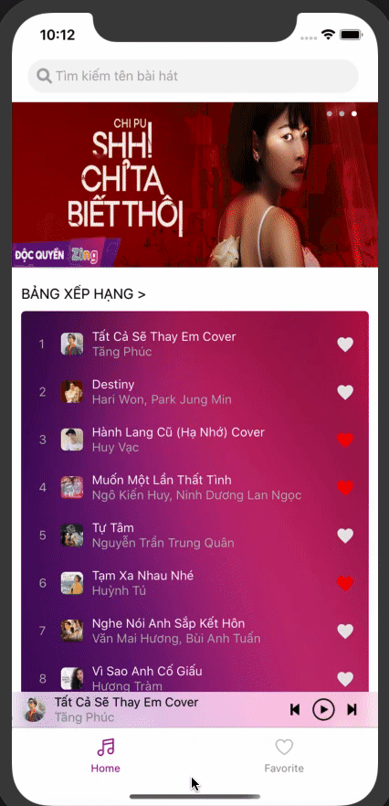

### run ios
rm -rf node_modules/ && yarn && cd ios && rm -rf Pods && rm -rf build && rm -rf Podfile.lock && pod install && cd .. && react-native run-ios --simulator="iPhone 11 Pro Max"

### run android
rm -rf node_modules/ && yarn && yarn android

npx jetifier && react-native bundle --platform android --dev false --entry-file index.js --bundle-output android/app/src/main/assets/index.android.bundle --assets-dest android/app/src/main/res && cd android && ./gradlew clean && ./gradlew assembleRelease && cd ..

cd android && ./gradlew clean && ./gradlew assembleRelease && cd ..

cd android && ./gradlew assembleRelease && cd ..

### intro video

### run

react-native run-ios --simulator="iPhone 11 Pro Max"

# fix build android
rm -rf ./android/app/src/main/res/drawable-*
rm -rf ./android/app/src/main/res/raw

# debug key hash

ga0RGNYHvNM5d0SLGQfpQWAPGJ8=
# release key hash
zY00cczs2SG28RTn1bZQvsCftvI=